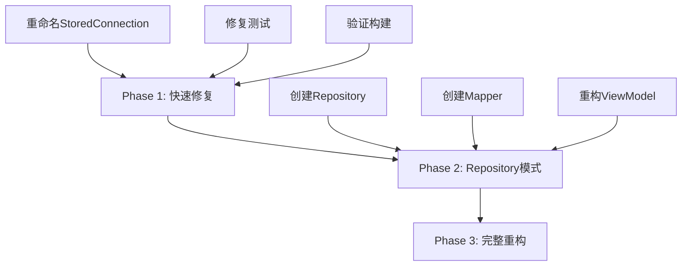

# 改进的实施方案 - Repository 模式

**文档版本**: 1.0  
**日期**: 2025-09-05  
**目标**: 快速解决构建问题 + 架构改进

## 📋 实施计划概览



## Phase 1: 快速修复（立即执行）

### Step 1.1: 重命名数据模型

**文件**: `Sources/SSHAIClient/Core/Data/LocalDataManager.swift`

```swift
// MARK: - Storage Models (数据库存储模型)
public struct StoredConnection: Equatable, Identifiable {
    public let id: String
    public let name: String
    public let host: String  // 将被加密存储
    public let port: Int
    public let username: String  // 将被加密存储
    public let createdAt: Date
    
    public init(id: String, name: String, host: String, port: Int, username: String, createdAt: Date) {
        self.id = id
        self.name = name
        self.host = host
        self.port = port
        self.username = username
        self.createdAt = createdAt
    }
}
```

### Step 1.2: 更新 LocalDataManager 方法

```swift
public final class LocalDataManager: @unchecked Sendable {
    // MARK: - CRUD: Connections
    public func upsertConnection(_ connection: StoredConnection) throws {
        let encHost = try encryptToB64(connection.host)
        let encUser = try encryptToB64(connection.username)
        try db?.run(connections.insert(or: .replace,
            id <- connection.id,
            name <- connection.name,
            host <- encHost,
            port <- connection.port,
            username <- encUser,
            createdAt <- connection.createdAt
        ))
    }
    
    public func listConnections() throws -> [StoredConnection] {
        let query = connections.order(createdAt.desc)
        return try db?.prepare(query).map { row in
            let hostB64 = try row.get(host)
            let userB64 = try row.get(username)
            return StoredConnection(
                id: try row.get(id),
                name: try row.get(name),
                host: try decryptFromB64(hostB64),
                port: try row.get(port),
                username: try decryptFromB64(userB64),
                createdAt: try row.get(createdAt)
            )
        } ?? []
    }
    
    public func deleteConnection(id: String) throws {
        let query = connections.filter(self.id == id)
        try db?.run(query.delete())
    }
}
```

### Step 1.3: 更新测试

**文件**: `Tests/SSHAIClientTests/SSHAIClientPersistenceTests.swift`

```swift
func testConnectionCRUD_withEncryption() throws {
    let connection = StoredConnection(
        id: "1",
        name: "test-encrypted",
        host: "localhost.encrypted",
        port: 2222,
        username: "testuser-encrypted",
        createdAt: Date()
    )
    try dataManager.upsertConnection(connection)
    // ... rest of test
}
```

## Phase 2: Repository 模式（构建通过后立即实施）

### Step 2.1: 创建 Repository 协议

**新文件**: `Sources/SSHAIClient/Core/Repositories/ConnectionRepository.swift`

```swift
import Foundation

// MARK: - Repository Protocol
public protocol ConnectionRepositoryProtocol {
    func fetchAll() async throws -> [SSHConnection]
    func save(_ connection: SSHConnection) async throws
    func delete(id: UUID) async throws
    func findByHost(_ host: String) async throws -> SSHConnection?
}

// MARK: - Repository Implementation
public final class ConnectionRepository: ConnectionRepositoryProtocol {
    private let dataManager: LocalDataManager
    private let mapper: ConnectionMapper
    
    public init(dataManager: LocalDataManager, mapper: ConnectionMapper = ConnectionMapper()) {
        self.dataManager = dataManager
        self.mapper = mapper
    }
    
    public func fetchAll() async throws -> [SSHConnection] {
        let storedConnections = try dataManager.listConnections()
        return storedConnections.map(mapper.toUIModel)
    }
    
    public func save(_ connection: SSHConnection) async throws {
        let storedModel = mapper.toStorageModel(connection)
        try dataManager.upsertConnection(storedModel)
    }
    
    public func delete(id: UUID) async throws {
        try dataManager.deleteConnection(id: id.uuidString)
    }
    
    public func findByHost(_ host: String) async throws -> SSHConnection? {
        let all = try await fetchAll()
        return all.first { $0.host == host }
    }
}
```

### Step 2.2: 创建 Mapper

**新文件**: `Sources/SSHAIClient/Core/Mappers/ConnectionMapper.swift`

```swift
import Foundation

public final class ConnectionMapper {
    
    /// 从存储模型转换到 UI 模型
    public func toUIModel(_ stored: StoredConnection) -> SSHConnection {
        return SSHConnection(
            id: UUID(uuidString: stored.id) ?? UUID(),
            name: stored.name,
            host: stored.host,
            port: stored.port,
            username: stored.username,
            group: nil,  // 这些 UI 属性需要从别的地方获取或设置默认值
            tags: [],
            isFavorite: false,
            lastConnected: nil
        )
    }
    
    /// 从 UI 模型转换到存储模型
    public func toStorageModel(_ ui: SSHConnection) -> StoredConnection {
        return StoredConnection(
            id: ui.id.uuidString,
            name: ui.name,
            host: ui.host,
            port: ui.port,
            username: ui.username,
            createdAt: Date()
        )
    }
}
```

### Step 2.3: 重构 ViewModel 使用 Repository

**更新文件**: `Sources/SSHAIClient/Features/ConnectionManager/ViewModels/ConnectionManagerViewModel.swift`

```swift
@available(macOS 11.0, *)
public final class ConnectionManagerViewModel: ObservableObject {
    @Published public var connections: [SSHConnection] = []
    @Published public var searchText: String = ""
    @Published public var selectedConnection: SSHConnection?
    @Published public var isLoading: Bool = false
    @Published public var errorMessage: String?
    
    private let repository: ConnectionRepositoryProtocol
    
    public init(repository: ConnectionRepositoryProtocol? = nil) {
        // 依赖注入，便于测试
        self.repository = repository ?? ConnectionRepository(
            dataManager: LocalDataManager()
        )
        
        Task {
            await loadConnections()
        }
    }
    
    @MainActor
    public func loadConnections() async {
        isLoading = true
        errorMessage = nil
        
        do {
            let loadedConnections = try await repository.fetchAll()
            
            // 如果数据库为空，加载示例数据
            if loadedConnections.isEmpty {
                self.connections = createDemoConnections()
            } else {
                self.connections = loadedConnections
            }
        } catch {
            errorMessage = "Failed to load connections: \(error.localizedDescription)"
            // 失败时显示演示数据
            self.connections = createDemoConnections()
        }
        
        isLoading = false
    }
    
    @MainActor
    public func saveConnection(_ connection: SSHConnection) async {
        do {
            try await repository.save(connection)
            await loadConnections()  // 重新加载列表
        } catch {
            errorMessage = "Failed to save connection: \(error.localizedDescription)"
        }
    }
    
    @MainActor
    public func deleteConnection(_ connection: SSHConnection) async {
        do {
            try await repository.delete(id: connection.id)
            await loadConnections()  // 重新加载列表
        } catch {
            errorMessage = "Failed to delete connection: \(error.localizedDescription)"
        }
    }
    
    private func createDemoConnections() -> [SSHConnection] {
        return [
            SSHConnection(name: "Prod Web", host: "prod.web.example.com", username: "ec2-user", group: "Production", tags: ["web", "nginx"], isFavorite: true),
            SSHConnection(name: "Prod DB", host: "prod.db.example.com", username: "postgres", group: "Production", tags: ["db", "postgres"], isFavorite: false),
            SSHConnection(name: "Staging", host: "stg.example.com", username: "deploy", group: "Staging", tags: ["stg"], isFavorite: false),
            SSHConnection(name: "Dev Mac Mini", host: "192.168.1.20", username: "clay", group: "Personal", tags: ["dev"], isFavorite: true)
        ]
    }
    
    // ... 其他现有方法保持不变
}
```

## Phase 3: 测试覆盖

### Step 3.1: Repository 单元测试

**新文件**: `Tests/SSHAIClientTests/ConnectionRepositoryTests.swift`

```swift
import XCTest
@testable import SSHAIClient

class ConnectionRepositoryTests: XCTestCase {
    var repository: ConnectionRepository!
    var mockDataManager: LocalDataManager!
    
    override func setUpWithError() throws {
        mockDataManager = LocalDataManager()
        try mockDataManager.initializeForTesting()
        repository = ConnectionRepository(dataManager: mockDataManager)
    }
    
    func testSaveAndFetchConnection() async throws {
        // Given
        let connection = SSHConnection(
            name: "Test Server",
            host: "test.example.com",
            username: "testuser"
        )
        
        // When
        try await repository.save(connection)
        let fetched = try await repository.fetchAll()
        
        // Then
        XCTAssertEqual(fetched.count, 1)
        XCTAssertEqual(fetched.first?.name, "Test Server")
        XCTAssertEqual(fetched.first?.host, "test.example.com")
    }
    
    func testDeleteConnection() async throws {
        // Given
        let connection = SSHConnection(
            name: "To Delete",
            host: "delete.example.com",
            username: "user"
        )
        try await repository.save(connection)
        
        // When
        try await repository.delete(id: connection.id)
        let fetched = try await repository.fetchAll()
        
        // Then
        XCTAssertEqual(fetched.count, 0)
    }
}
```

### Step 3.2: Mapper 单元测试

**新文件**: `Tests/SSHAIClientTests/ConnectionMapperTests.swift`

```swift
import XCTest
@testable import SSHAIClient

class ConnectionMapperTests: XCTestCase {
    var mapper: ConnectionMapper!
    
    override func setUp() {
        mapper = ConnectionMapper()
    }
    
    func testMappingToStorageModel() {
        // Given
        let uiModel = SSHConnection(
            name: "Test",
            host: "host.com",
            port: 22,
            username: "user",
            group: "Test Group",
            tags: ["tag1", "tag2"],
            isFavorite: true
        )
        
        // When
        let storageModel = mapper.toStorageModel(uiModel)
        
        // Then
        XCTAssertEqual(storageModel.id, uiModel.id.uuidString)
        XCTAssertEqual(storageModel.name, "Test")
        XCTAssertEqual(storageModel.host, "host.com")
        XCTAssertEqual(storageModel.port, 22)
        XCTAssertEqual(storageModel.username, "user")
    }
    
    func testMappingToUIModel() {
        // Given
        let id = UUID().uuidString
        let storageModel = StoredConnection(
            id: id,
            name: "Test",
            host: "host.com",
            port: 22,
            username: "user",
            createdAt: Date()
        )
        
        // When
        let uiModel = mapper.toUIModel(storageModel)
        
        // Then
        XCTAssertEqual(uiModel.id.uuidString, id)
        XCTAssertEqual(uiModel.name, "Test")
        XCTAssertEqual(uiModel.host, "host.com")
        XCTAssertEqual(uiModel.port, 22)
        XCTAssertEqual(uiModel.username, "user")
        XCTAssertNil(uiModel.group)
        XCTAssertEqual(uiModel.tags, [])
        XCTAssertFalse(uiModel.isFavorite)
    }
}
```

## 验证检查清单

### Phase 1 验证
- [ ] `swift build` 构建成功
- [ ] `swift test` 所有测试通过
- [ ] 无命名冲突警告

### Phase 2 验证
- [ ] Repository 正确封装数据访问
- [ ] Mapper 正确转换模型
- [ ] ViewModel 使用 Repository 而非直接访问 DataManager

### Phase 3 验证
- [ ] 测试覆盖率 > 80%
- [ ] 所有关键路径都有测试
- [ ] Mock 对象正确实现

## 时间估算

| Phase | 预计时间 | 复杂度 |
|-------|---------|--------|
| Phase 1 | 30 分钟 | 低 |
| Phase 2 | 1-2 小时 | 中 |
| Phase 3 | 1 小时 | 低 |

## 优势总结

1. **立即解决构建问题** - Phase 1 快速修复
2. **符合最佳实践** - Repository 模式是 iOS 社区广泛接受的模式
3. **提高可测试性** - 依赖注入使测试更容易
4. **清晰的职责分离** - 每个组件有明确的单一职责
5. **易于扩展** - 未来可以轻松添加缓存、同步等功能

## 下一步行动

1. **立即执行 Phase 1** - 解决构建阻塞问题
2. **构建成功后执行 Phase 2** - 引入 Repository 模式
3. **完成后添加测试** - 确保代码质量
